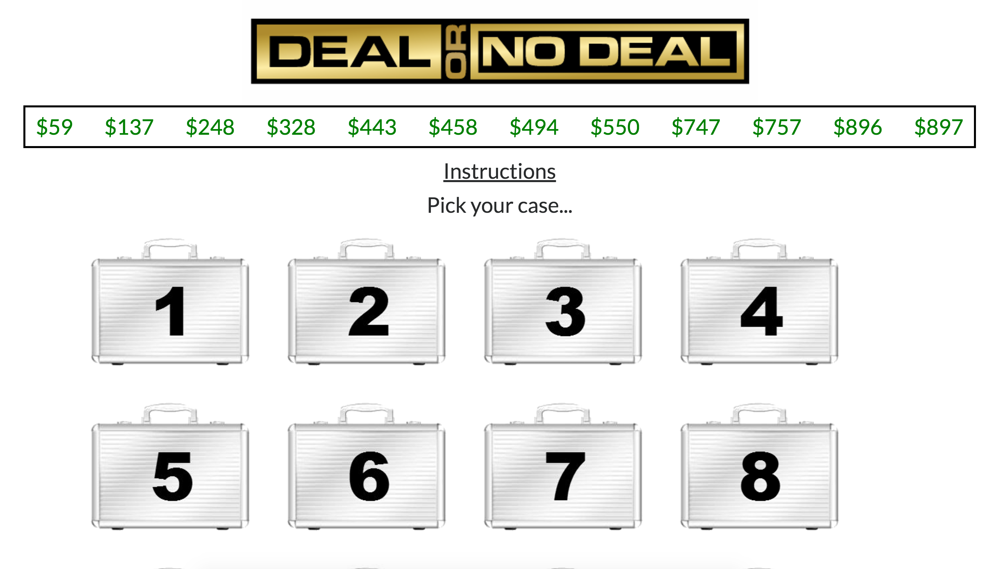
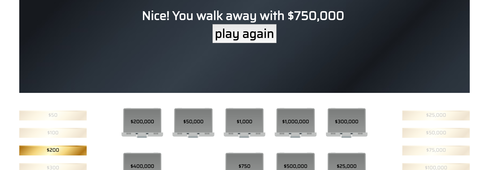

# deal-or-no-deal
CODA project week

## game & rules.
Welcome to Deal or No Deal! In this TV-based gambling game, there are 20 cases each containing a grand prize between $50 and $1,000,000. You will select one case and progress through stages, opening the cases left to reveal amount inside. After each stage the Banker will make you an offer. He will try to buy your case for as *little* as possible based on the prizes visible on the board. This is where you must answer the million-dollar question... Deal or No Deal? If you choose Deal at any point, you immediately walk away with the current offer and you can open your own case to see if you made the right decision. If you choose No Deal, you must continue to open cases until you complete the next stage. If you make it to the very end and you're feeling lucky, you may switch your case for the last one remaining on the board. At this point you take home the money whichever case you choose so choose wisely! 

## technologies used.
This game was built using HTML, CSS, and Javascript. The highscores database was created with Firebase.

## process/approach.

#### Choice
I chose Deal or No Deal because I built a preliminary version of it for a previous lab. As I was looking through my old code, I realized it could be DRYer so I scrapped everything and started from square one. Between the two projects I see a lot of progress not only in the
front end design but also in the organization of the code!

old project for reference:

#### Graphics
The graphics I used are free vector images found online. I modified them with Adobe Illustrator and Photoshop.

#### Organization
My game has multiple javascript components. Organization is very important to me so I kept these components in separate js files.

#### Internal Data Structure & Scalability
I created a unique "Case" class to store each case' number, dollar amount, and whether or not it's been opened. The dollar values for each case are randomly assigned from a hard-coded array of dollar values. Scalability is not a problem; if I wanted to increase the number of cases from 20 to 25, I would have to change one variable  and manually add the 5 extra dollar amounts. The number of cases in each row is also a variable which can easily be changed if desired.

## future features.
Right now I have a fully-functioning game. Additional features could include:
  * a 10-second countdown timer when given the option to swap cases
  * computer support/coaching when player is faced with a risky Deal or No Deal decision-- just like the actual TV show
  * themes to choose from since my case graphics come in three colors

## bugs.
1. I used set/clearInterval to coordinate the flashing instructions and it was troubling at first. I originally wrapped setInterval() in  a function which prevented me from accessing that function later on. I solved the issue by setting the variable equal to just setInterval() instead.

  

  
Explanation

    Issue:  

    var interval = function(){
      setInterval(..., 1200);
    }

      
    Solution:  

    var interval = setInterval(function(){
      .
      .
      .
    }, 1200);

      
  

1. Switching cases on the last round gave me this problem:

  

  The final gold block should match the amount in the black header but this block corresponds to the value of the case that was swapped.  

  
Explanation

   
    When the user chooses his/her case at the beginning of the game, that case's class changes from "case" to "selected". When a case is opened, its class changes from "case" to "opened" and its respective money block fades out. But if a case is swapped at the end, its retains the class "selected" and nothing will fade out. I solved this issue by fading the gold block corresponding to the case that was won.
  

1. Making the page mobile-friendly was easy thanks to Bootstrap, but the scaling of my graphics was harder to figure out. I wanted them to scale nicely, and they did, except there was a breakpoint where they would become too small. I added some media queries to handle the margin and sizing of these elements to prevent them from looking like thumbnails.

## wins and challenges.
* Wins
  * having a minimum viable product after day 2
  * writing clean code that is reused for each stage of the game
  * successfully implementing a highscores table by reading and writing data to Firebase (definitely my highest high)
* Challenges
  * configuring Firebase
  * finding an accurate banker's formula on the internet
  * making the page responsive when browser is resized, or when viewed on a mobile device (it still could use some work)

##  process for turning that game into a web application (wireframes, blockers/issues that popped up).
My goal was to make a single-page dynamic web app instead of having multiple html files. I accomplished this using css to add animation effects and jQuery to hide and show DOM elements.

## links
* [trello board](https://trello.com/b/th29qf5H/deal-or-no-deal)
* [wireframe](https://wireframe.cc/P2djAa)
