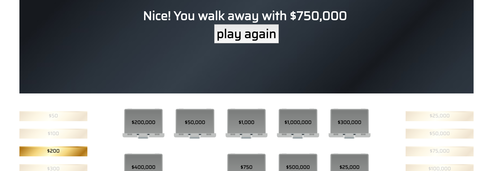

# deal-or-no-deal
CODA project week

## game & rules.
Welcome to Deal or No Deal! In this gambling game based on the hit NBC TV show you must choose one of 20 cases each containing a grand prize between $50 and $1,000,000. Once you have your case, you'll open the other cases in stages to reveal amount inside. After each stage the Banker will make you an offer. He will try to buy your case for as *little* as possible based on the dollar amounts left. This is where you must answer the million-dollar question... Deal or No Deal? If you choose Deal, you immediately walk away with the Banker's offer but if you choose No Deal, you must continue to open cases until you complete the next stage. If you're feeling lucky you may switch cases but only at the very end. But be advised, you cannot undo any of your decisions so choose wisely!

## technologies used.
This game was built using HTML, CSS, and Javascript. I used Firebase for the highscores table.

## process/approach.

#### Choice
I chose Deal or No Deal because I built a preliminary version of it for a previous lab. As I was looking through my old code, I realized it could be DRYer so I scrapped everything and started from square one. Between the two projects I see a lot of progress not only in the
front end design but also in the organization of the code!

#### Graphics
The graphics I used are free vector images found online. I modified them slightly with Adobe Illustrator and crated a transparent background with Photoshop.

#### Organization
My game has three javascript components: the internal data structure, the game logic, and the banker's formula. Organization is very important to me so I kept these components in separate js files.

#### Internal Data Structure & Scalability
I created a unique "Case" class to store each case' number, dollar amount, and whether or not it's been opened. The dollar values for each case are randomly assigned from a hard-coded array of dollar values. Scalability is not a problem; if I wanted to increase the number of cases from 20 to 25, I would have to change one variable  and manually add the 5 extra dollar amounts. The number of cases in each row is also a variable which can easily be changed if desired.

## future features.
Right now I have a fully-functioning game. If time allows, I'd like to add the following:
  * a title screen with a large "Play" button and a cool fading effect
  * a :10 second countdown timer when given the option to swap cases
  * improve page responsiveness when browser is resized
  * sound effects
  * computer support/coaching when player is faced with a risky Deal or No Deal decision-- just like the actual TV show

## bugs.
1. I used set/clearInterval to coordinate the flashing instructions and it was troubling at first. I originally wrapped setInterval() in  a function which prevented me from accessing that function later on. I solved the issue by setting the variable equal to just setInterval() instead.

  

  
Explanation

    Before:  

    var interval = function(){
      setInterval(..., 1200);
    }

      
    After:  

    var interval = setInterval(function(){
      .
      .
      .
    }, 1200);

      
  

1. If the user switches their case on the last round I would end up with this problem:

  

  The final gold block should match the amount in the black header but this block corresponds to the value of the case that was swapped.  

  
Explanation

   
    When the user chooses his/her case at the beginning of the game, that case's class changes from "case" to "selected". When a case is opened, its class changes from "case" to "opened". But if a case is swapped at the end, its retains the class "selected". I have a function that fades out the gold block matching the value of each "opened" case, so what I forgot to do here was to (1) fade out the case on the board with the "selected" class and (2) keep the block corresponding to the case that was won.
  

## wins and challenges.
* Wins
  * having a MVP after day 2
  * writing clean code that is reused for each stage of the game
  * creating a highscores table by reading and writing data to Firebase (definitely my highest high)
* Challenges
  * finding an accurate banker's formula on the internet
  * making the page responsive when browser is resized, or when viewed on a mobile device

##  process for turning that game into a web application (wireframes, blockers/issues that popped up).

## links
* [trello board](http://google.com)
* [wireframe](https://wireframe.cc/P2djAa)
